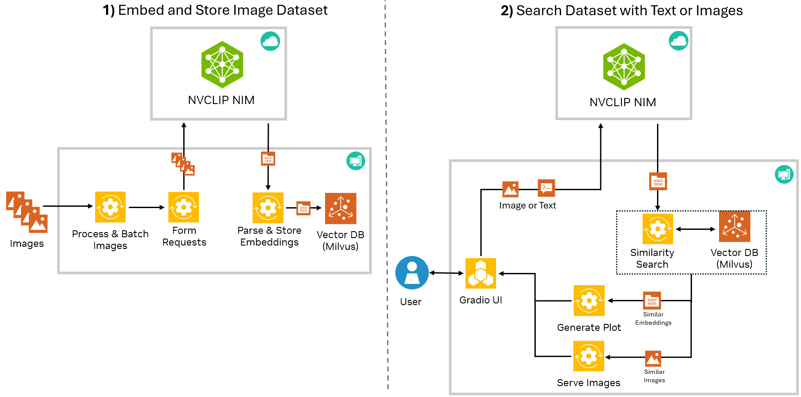
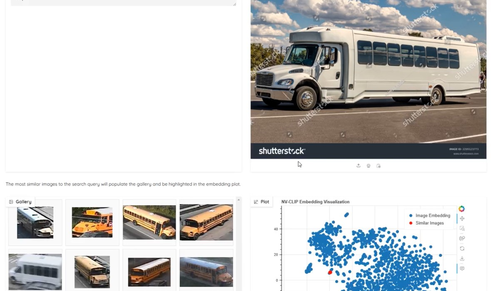

# NV-CLIP Multimodal Search with NIMs


## Introduction

This example shows how to use the NV-CLIP NIM to and combine it with a vector database to rapidly search a collection of images using text and image prompts. 



## Setup 
1. Clone this repo 
```
git clone https://github.com/affanrasheed/Multimodal_Generative_AI.git
cd Multimodal_Generative_AI/image_search
```
2. Install dependencies
```
conda create -n img_ser python=3.10
conda activate img_ser
pip3 install -r requirements.txt
```
## Semantic Search Demo
The semantic search demo will use the NVCLIP NIM to generate embeddings for any given folder of images on your local computer. Then from the Gradio UI, you will be able to view a plot of the embeddings and search your images through text and image prompts. 



To launch the multimodal search demo on its own, you can run the main.py script directly and provide the necessary arguments: 

```
python3 main.py images/my_images nvapi-***
```

The only required arguments are a path to a folder of images and your NIM API key. Once launched, the script will use the NV-CLIP NIM to generate embeddings for each image in the provided folder and store the embeddings in a local Milvus vector database. Depending on how many images you have in your folder, this may take several minutes. Note that each request to NV-CLIP will use 1 credit and each NV-CLIP request can embed up to 64 images at a time. For example, a folder with 256 images will use 4 credits.

Once the script is launched, the Gradio UI will become available at ```http://localhost:7860```


