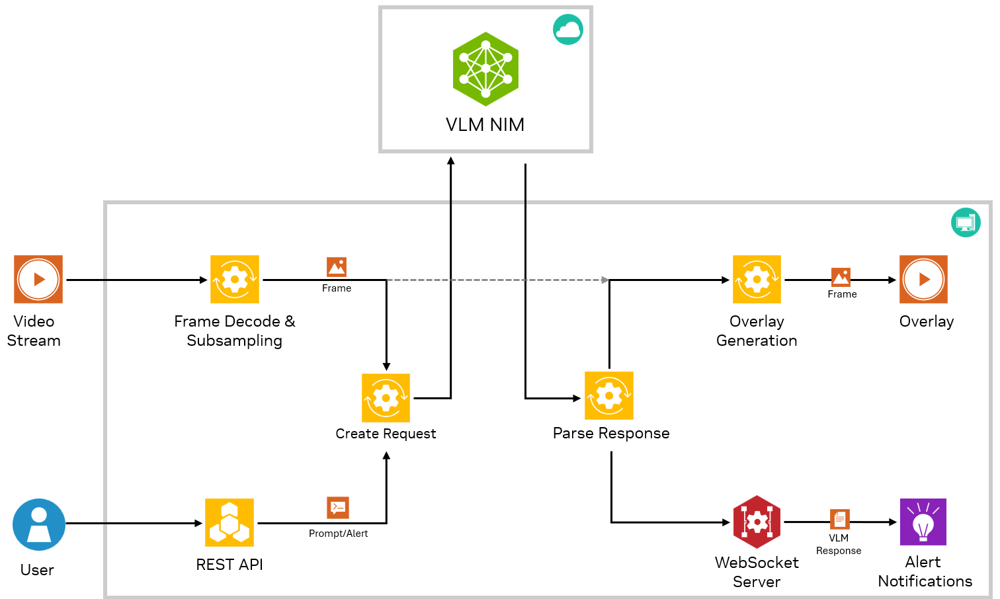
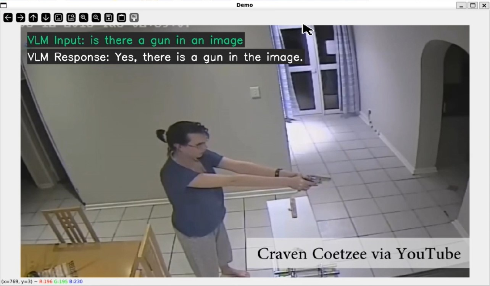
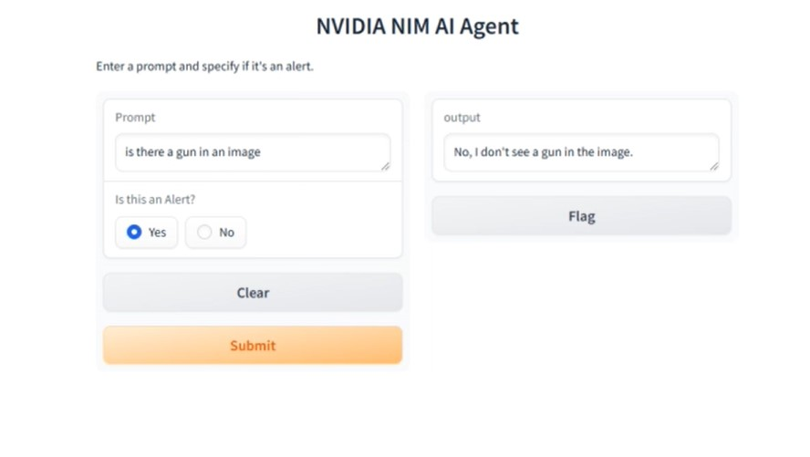

# VLM Video Alerts with NIMs


## Introduction

This example shows how to use a Visual Language Model NIM combined with streaming video to build an application that allows you to chat with a video and set looping prompts for alert use cases. 

For example, the VLM NIM can be set to monitor video input of drone footage that contains sections of a wildfire. A continuous prompt can then be set asking the VLM "Is there a fire?" on the video input. The VLM will then watch for a fire in the video stream and can send a notification to the user when it detects a fire. This detection could then be connected with another script to take some action such as sending a push notification to a mobile app. This example could also be extended to build a more complex VLM agent capable of detecting many alerts across several live video streams using NIMs. 



## Setup 
1. Clone this repo 
```
git clone https://github.com/affanrasheed/Multimodal_Generative_AI.git
cd Multimodal_Generative_AI/vision_text_extraction
```
2. Install dependencies
```
conda create -n vis_alert python=3.9
conda activate vis_elert
pip3 install -r requirements.txt
```

## Streaming Pipeline
To launch the streaming pipeline on its own, you can run the main.py directly and provide the necessary arguments:

```
python3 main.py --model https://ai.api.nvidia.com/v1/vlm/nvidia/neva-22b --video_file test_video.mp4 --api_key "nvapi-123" --overlay --loop_video
```




All VLM nims are supported. The following list can be used in the --model_url argument of main.py 

- https://ai.api.nvidia.com/v1/gr/meta/llama-3.2-90b-vision-instruct
- https://ai.api.nvidia.com/v1/gr/meta/llama-3.2-11b-vision-instruct
- https://ai.api.nvidia.com/v1/vlm/nvidia/vila
- https://ai.api.nvidia.com/v1/vlm/nvidia/neva-22b
- https://ai.api.nvidia.com/v1/vlm/microsoft/kosmos-2
- https://ai.api.nvidia.com/v1/vlm/adept/fuyu-8b
- https://ai.api.nvidia.com/v1/vlm/google/paligemma
- https://ai.api.nvidia.com/v1/vlm/microsoft/phi-3-vision-128k-instruct


Your api key should come from [build.nvidia.com](http://build.nvidia.com) 

Once it is launched, you should see a window pop up with the video playing and the REST API endpoint should be live to send prompt updates.

## Streaming Pipeline Client
Once the main script is launched, the streaming pipeline can be interacted with through the query REST API endpoint .  

You can call this endpoint by running one of the gradio client
```
python3 client_gradio.py
```



