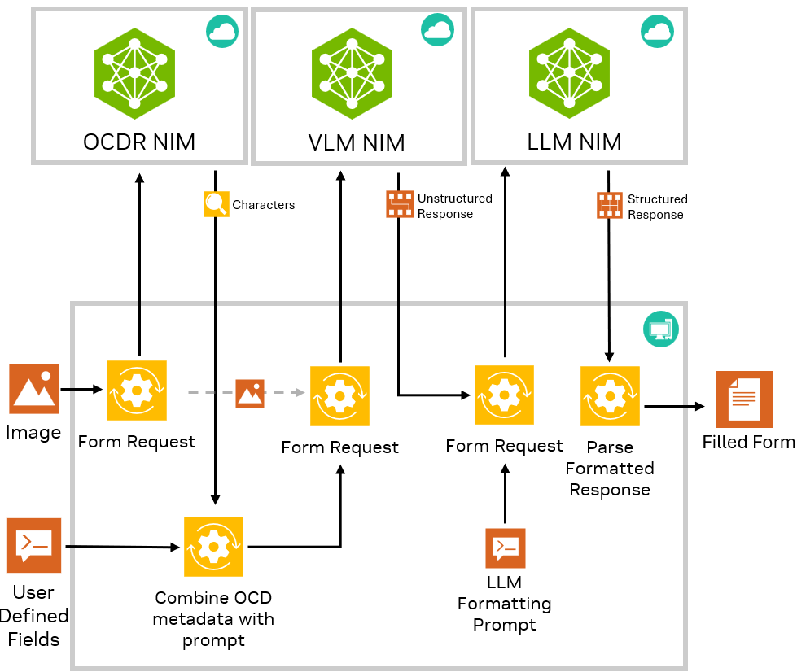
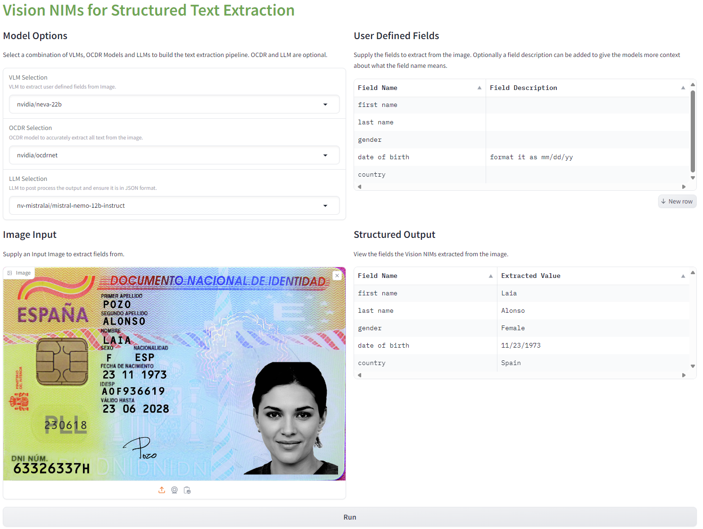

# Structured Text Extraction with Nvidia NIMs


## Introduction

This project shows how to use Vision NIMs (VLMs, Florence, OCDRNet) and LLMs to create a robust pipeline for structured text extraction from images. 

It is often a challenge to extract specific pieces of information from documents such Photo IDs. With many different formats of Photo IDs and irregular placement of key information it can be difficult to use traditional CV models to robustly extract fields from the Photo ID such as First Name, Last Name, Date of Birth etc.

This workflow shows how to build a robust text extraction pipeline where the user can specify in natural language what fields to extract from a given image and receive the filled out fields in JSON format. This pipeline is not limited to working on just Photo IDs but can be applied to any type of input image or document where the user want's to extract key information in a structured format. The fields to extract are fully customizable and not hard coded for any specific use case.



## Setup 
1. Clone this repo 
```
git clone https://github.com/affanrasheed/Multimodal_Generative_AI.git
cd Multimodal_Generative_AI/vision_text_extraction
```
2. Install dependencies
```
conda create -n vis_ext python=3.10
conda activate vis_ext
pip3 install -r requirements.txt
```

## Testing for Structured Text Extraction
To launch the demo, run the main.py directly and provide your API Key. Your API key should come from [build.nvidia.com](http://build.nvidia.com).
```
python3 main.py "nvapi-123"
```
Once it is launched, you can access the Gradio UI at http://localhost:7860

From the UI, you will be able to configure the VLM, OCDR model and LLM model used to build the structured text extraction pipeline as well as define any custom fields to extract from input images. The outputs will be presented in a tabular format. 

## Output

